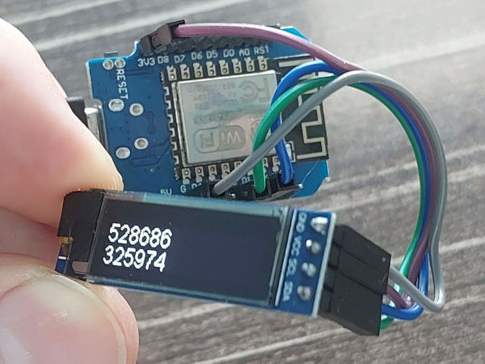
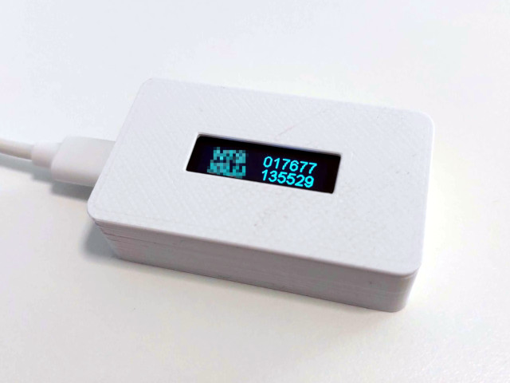

# ESP8266 OTP Display

## Overview

This repository contains an Arduino sketch for an ESP8266 module equipped with an I2C display. The sketch is designed to connect to a specified Wi-Fi network, synchronize the time with an NTP server, calculate a One-Time Password (OTP) based on a secret key, and display this OTP on the screen. This functionality is typically used in two-factor authentication systems.



A suitable case can be found here: [Wemos D1 Case with Display on Thingiverse](https://www.thingiverse.com/thing:6347339)



## Features

- Connects to a predefined Wi-Fi network.
- Synchronizes time with a specified NTP server.
- Calculates and displays two Time-based One-Time Passwords (TOTP) on the I2C display.

## How to Use

1. **Set up your ESP8266 environment:**
   Ensure that your Arduino IDE is configured to program the ESP8266 and that all necessary libraries (`ESP8266WiFi`, `WiFiUdp`, `NTPClient`, `Wire`, `SSD1306Wire`, `TOTP`) are installed.

2. **Configuring the sketch:**
   - Update the Wi-Fi credentials (`ssid` and `password`) in the sketch with your network's details.
   - Set the NTP server address and the UTC offset in seconds for your time zone.
   - Replace the placeholder for the `secret1` and `secret2` byte arrays with your actual OTP secret keys.
   - Replace the labels "OTP1" and "OTP2" if needed.

3. **Uploading the sketch:**
   - Connect your ESP8266 to your computer and select the correct board and port in the Arduino IDE.
   - Upload the sketch to the ESP8266.

## Converting Your Base32 Key

If your OTP secret key is in Base32 format (common with many authentication systems), you'll need to convert it to a byte array format to use in this sketch. You can use the following Python script to do this:

```python
import base64

def base32_to_byte_array(base32_string):
    # Decode the Base32 string into bytes
    decoded_bytes = base64.b32decode(base32_string, casefold=True)
    return [byte for byte in decoded_bytes]

# Example usage
base32_secret = "YOUR_BASE32_SECRET"  # Replace with your actual Base32 secret
byte_array = base32_to_byte_array(base32_secret)

# Print the byte array in hexadecimal format
print("Decoded bytes in hex format:", ', '.join('0x{:02x}'.format(byte) for byte in byte_array))

